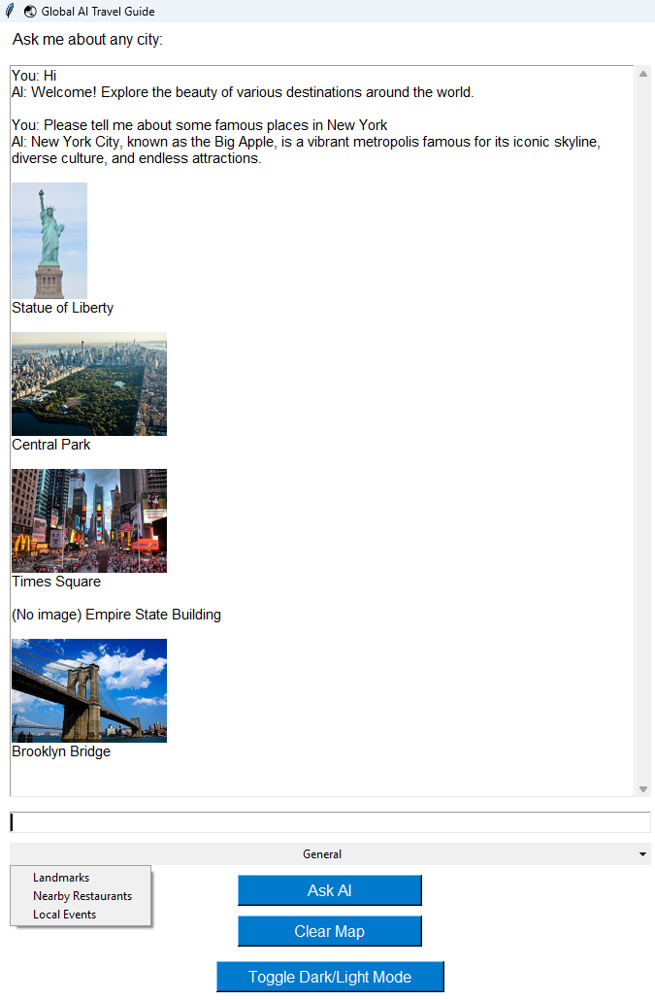
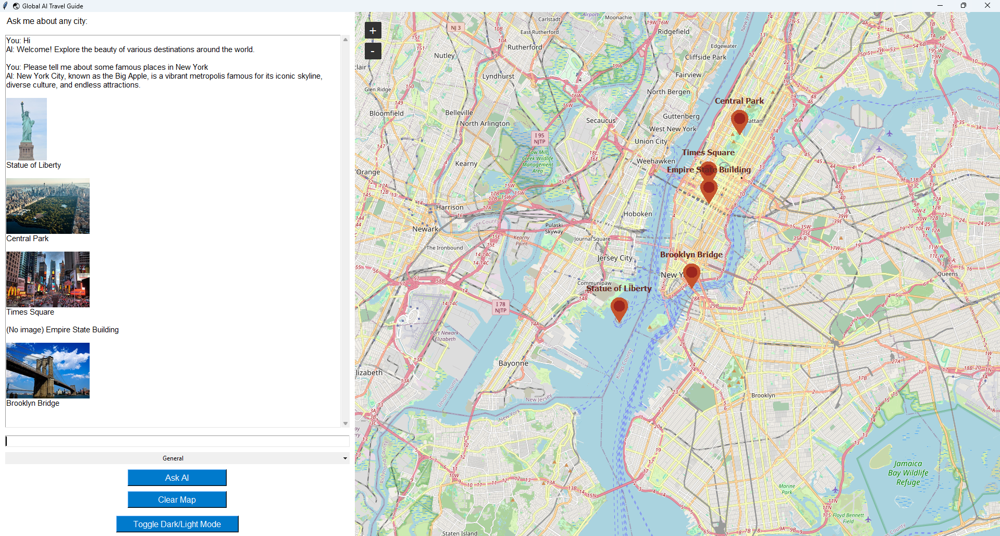

# 🌏 Global AI Travel Guide

A desktop travel guide application powered by **AI** that helps users explore cities, landmarks, restaurants, and local events. Visualize locations on an **interactive map** and see images fetched from Wikipedia and Wikimedia Commons.  

---

## 🔹 Features

- Ask AI about any **city or landmark**.
- Get **landmarks**, **nearby restaurants**, or **local events** based on user queries.
- Interactive **map view** with markers for each place.
- Automatically fetch **images** for landmarks and restaurants.
- Toggle between **light and dark themes**.
- Threaded responses to prevent UI freezing.

---

## 📸 Screenshots

**Light Mode**

**Dark Mode**

**Map with Landmarks and Restaurants**

> *Replace the above images with actual screenshots from your app.*

---

## 🗂 Project Structure

# Global_AI_Travel_Guide
