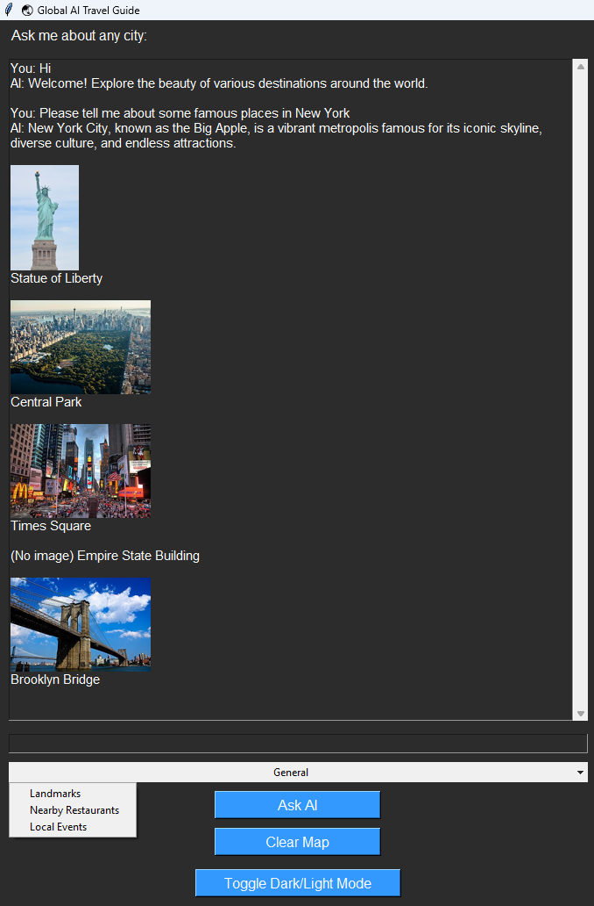

# 🌏 Global AI Travel Guide


A desktop travel guide application powered by **AI** that helps users explore cities, landmarks, restaurants, and local events. Visualize locations on an **interactive map** and see images fetched from Wikipedia and Wikimedia Commons.  

---

## 🔹 Features

- Ask AI about any **city or landmark**.
- Get **landmarks**, **nearby restaurants**, or **local events** based on user queries.
- Interactive **map view** with markers for each place.
- Automatically fetch **images** for landmarks and restaurants.
- Toggle between **light and dark themes**.
- Threaded responses to prevent UI freezing.

---

## 📸 Screenshots

**Light Mode / Dark Mode**

<div style="display: flex; gap: 100px;">
  
  
</div>

**Map with Landmarks and Restaurants**


---

## 🗂 Project Structure

# Global_AI_Travel_Guide

Global_AI_Travel_Guide/ <br>
│ <br>
├── main.py # Main application entry point <br>
├── .env # Environment variables (OpenAI API Key) <br>
├── requirements.txt # Python dependencies <br>
├── README.md <br>
├── screenshots/ # Folder for app screenshots <br>
├── utils/ <br>
│ ├── ai_helper.py # Functions for AI API communication <br>
│ ├── map_helper.py # Functions for map markers & image fetching <br>
│ └── init.py <br>

---

## ⚡ Setup Instructions

1. **Clone the repository**

```bash
git clone https://github.com/yourusername/Global_AI_Travel_Guide.git
cd Global_AI_Travel_Guide
```
2. **Create a virtual environment (recommended)**

```bash
python -m venv venv
source venv/bin/activate   # Linux / macOS
venv\Scripts\activate      # Windows
```
3. **Install dependencies**

```bash
pip install -r requirements.txt
```
4. **Setup OpenAI API Key**

```bash
OPENAI_API_KEY=your_openai_api_key_here
```
> *Replace your_openai_api_key_here with your actual OpenAI API key.*

---
## 🚀 Usage

1. **Run the application:**

```bash
python main.py
```
2. **Enter a city or landmark** in the input box.
3. **Select an action** from the dropdown menu:
   - General
   - Landmarks
   - Nearby Restaurants
   - Local Events
4. Click **Ask AI** to get AI-powered responses and see markers on the map.
5. Use **Clear Map** to remove all markers.
6. Toggle **Dark/Light Mode** for better visibility.

---

## 🧩 Dependencies

- Python 3.11+
- [OpenAI](https://pypi.org/project/openai/)
- [Tkinter (built-in with Python)](https://docs.python.org/3/library/tkinter.html)
- [TkinterMapView](https://pypi.org/project/tkintermapview/)
- [geopy](https://pypi.org/project/geopy/)
- [Pillow](https://pypi.org/project/Pillow/)
- [requests](https://pypi.org/project/requests/)
- [python-dotenv](https://pypi.org/project/python-dotenv/)
- [wikipedia](https://pypi.org/project/wikipedia/)

---

## 💡 Notes

- Ensure a stable internet connection for AI responses and image fetching.
- The AI responses rely on **GPT-4o-mini** via OpenAI.
- Wikimedia/Wikipedia images may not always be available for every landmark or restaurant.

---

## 📄 License

This project is licensed under the **MIT License** – see the [LICENSE](LICENSE) file for details.

---

## ⭐ Contributing

Contributions are welcome! Feel free to submit pull requests or open issues for improvements, bug fixes, or new features.

---

## 🙏 Acknowledgements

- OpenAI GPT API for AI-powered responses  
- Tkinter and TkinterMapView for GUI and maps  
- Wikimedia Commons / Wikipedia for images  
- Geopy for geolocation


---


