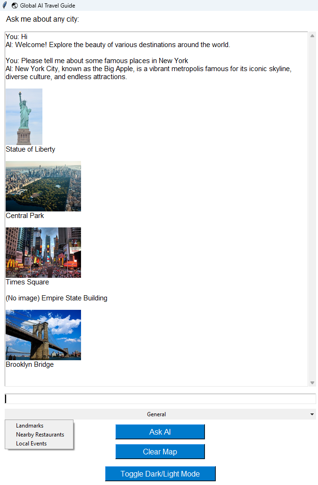
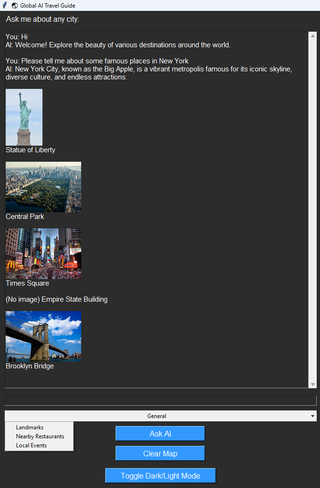
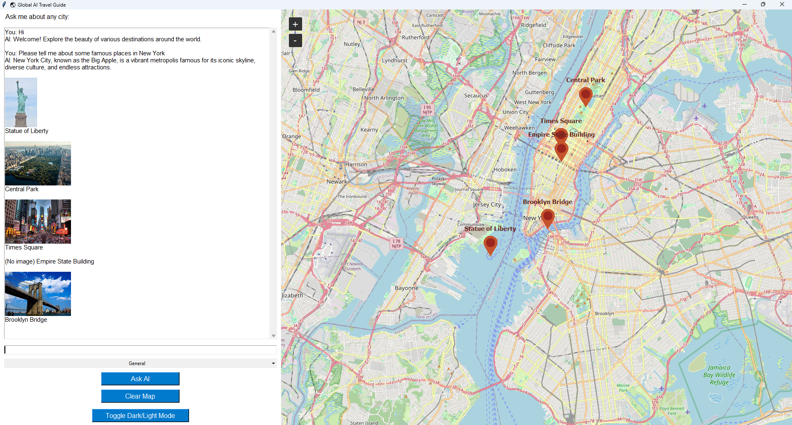

<div align="center">
  
# 🌏 AI Travel Guide

A Python + Tkinter desktop travel guide powered by GPT-4o-mini that explores landmarks, restaurants, and local events for any city worldwide, with an interactive map and auto fetched Wikipedia images.

<p align="center">


</p>


</div>

---

## 📖 Overview

**AI Travel Guide** is a fully offline-capable desktop application that turns any city name into a rich travel briefing powered by OpenAI's GPT-4o-mini. Ask about landmarks, discover nearby restaurants, or check out local events for anywhere in the world. Every query plots live markers on an embedded interactive map, and landmark images are automatically pulled from Wikipedia and Wikimedia Commons. A clean light/dark theme toggle and threaded API calls keep the UI fast and smooth at all times.

---

## 🖼️ Screenshots

| Light Mode | Dark Mode |
|-----------|-----------|
|  |  |

| 📍Interactive Map with Markers |
|------------------------------|
|  |

> _Landmarks plotted live on the map with individual markers for each result_

---

## ✨ Features

- 🤖 **GPT-4o-mini powered responses**: ask about any city, landmark, or attraction worldwide
- 🗺️ **Interactive map**: results are plotted live with markers via TkinterMapView
- 🏛️ **Four query modes**: General, Landmarks, Nearby Restaurants, Local Events
- 🖼️ **Auto-fetched images**: landmark and restaurant photos pulled from Wikipedia & Wikimedia Commons
- 🌗 **Light / Dark theme**: toggle at any time without restarting
- ⚡ **Threaded responses**: API calls run in background threads so the UI never freezes
- 🔒 **Secure API key handling**: credentials loaded from a `.env` file, never hardcoded
- 🧹 **Clear Map**: remove all markers with a single click

---

## 🕹️ Query Modes

| Mode | What the AI Returns |
|------|---------------------|
| **General** | Overview, history, culture, and travel tips for the city |
| **Landmarks** | Top sights and attractions with descriptions and map markers |
| **Nearby Restaurants** | Popular dining spots with cuisine type and map markers |
| **Local Events** | Festivals, events, and things happening in the area |

---

## 🔧 How It Works

```
User types a city / landmark + selects a query mode
                │
                ▼
        ai_helper.py sends prompt to
        OpenAI GPT-4o-mini API
                │
                ▼
        AI returns structured response
        (place names + descriptions)
                │
                ▼
        map_helper.py geocodes each place
        via geopy (Nominatim)
                │
                ▼
        TkinterMapView plots markers
        on the embedded map
                │
                ▼
        Wikipedia / Wikimedia Commons
        fetches images for each result
                │
                ▼
        Results + images displayed
        in the GUI panel ✅
```

---

## 🛠️ Tech Stack

| Tool | Purpose |
|------|---------|
| `Python 3.11` | Core language |
| `tkinter` | Desktop GUI framework (built into Python) |
| `TkinterMapView` | Embedded interactive map with marker support |
| `OpenAI API` | GPT-4o-mini for travel query responses |
| `geopy` | Geocoding place names to lat/lng coordinates |
| `wikipedia` | Fetching landmark descriptions and images |
| `Pillow` | Image loading and display in the GUI |
| `requests` | HTTP calls to Wikimedia Commons |
| `python-dotenv` | Secure `.env` API key loading |

---

## ⚙️ Requirements

- Python 3.11+
- An OpenAI API key ([get one here](https://platform.openai.com/api-keys))
- The libraries in `requirements.txt`

---

## 🚀 Getting Started

**1. Clone the repository**
```bash
git clone https://github.com/MusaIslamFahad/Global_AI_Travel_Guide.git
cd Global_AI_Travel_Guide
```

**2. Create a virtual environment (recommended)**
```bash
python -m venv venv
source venv/bin/activate        # macOS / Linux
venv\Scripts\activate           # Windows
```

**3. Install dependencies**
```bash
pip install -r requirements.txt
```

**4. Set up your OpenAI API key**

Create a `.env` file in the project root:
```
OPENAI_API_KEY=your_openai_api_key_here
```

> ⚠️ **Security:** Never commit your `.env` file. Add it to `.gitignore` to keep your API key private.

**5. Run the application**
```bash
python "Global_AI_Travel _Guide/main.py"
```

---

## 🕹️ How to Use

1. Type a **city name or landmark** in the input box (e.g. `Paris`, `Tokyo Tower`, `New York`)
2. Select a **query mode** from the dropdown- General, Landmarks, Nearby Restaurants, or Local Events
3. Click **Ask AI**: the AI response appears in the panel and markers are plotted on the map
4. Click any **map marker** to see the place name
5. Click **Clear Map** to remove all markers and start fresh
6. Click the **theme toggle** (top right) to switch between Light and Dark mode

---

## 📂 Project Structure

```
ai-travel-guide/
│
├── Global_AI_Travel _Guide/
│   ├── main.py              # App entry point — GUI layout, event loop, theme toggle
│   ├── .env                 # API key — DO NOT commit (add to .gitignore)
│   ├── requirements.txt     # Python dependencies
│   └── utils/
│       ├── ai_helper.py     # OpenAI GPT-4o-mini API communication & prompt logic
│       ├── map_helper.py    # Geopy geocoding, TkinterMapView markers, image fetching
│       └── __init__.py
│
├── screenshots/             # App screenshots for the README
│   ├── light_mode.png
│   ├── dark_mode.png
│   └── map_markers.png
│
└── README.md
```

**Recommended `.gitignore`:**
```
.env
venv/
__pycache__/
*.pyc
```

---

## 🔮 Future Enhancements

- 💾 **Save trips**: bookmark favourite cities and export results to PDF
- 🔍 **Search history**: log previous queries for quick re-access
- 🌐 **Multi-language support**: get AI responses in the user's preferred language
- 📅 **Live events API**: replace static AI event suggestions with a real events data feed
- 🧭 **Route planning**; draw routes between multiple landmarks on the map
- 📱 **Web version**: port the app to a browser interface using Streamlit or Flask

---

## 🤝 Contributing

Contributions, bug reports, and feature requests are welcome!

1. Fork the repository
2. Create a feature branch (`git checkout -b feature/your-feature`)
3. Commit your changes (`git commit -m 'Add your feature'`)
4. Push to the branch (`git push origin feature/your-feature`)
5. Open a Pull Request

---

## 🙏 Acknowledgements

- [OpenAI](https://openai.com/) for the GPT-4o-mini API
- [TkinterMapView](https://github.com/TomSchimansky/TkinterMapView) for the embedded map widget
- [Geopy](https://geopy.readthedocs.io/) for geocoding
- [Wikipedia](https://pypi.org/project/wikipedia/) & [Wikimedia Commons](https://commons.wikimedia.org/) for landmark images

---

## 📄 License

This project is licensed under the [MIT License](LICENSE).

---

## 👨‍💻 Author

**Musa Islam Fahad**
- GitHub: [@MusaIslamFahad](https://github.com/MusaIslamFahad)

---

> ⭐ If this helped you build or learn something, a star goes a long way. Thank you!
